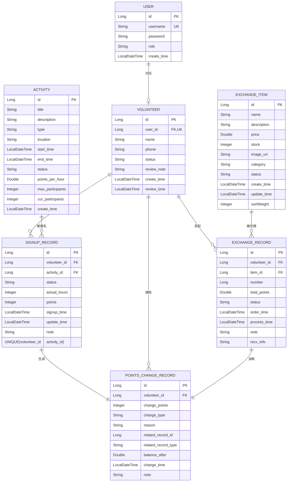

# 数据库作业：社区志愿服务平台

[TOC]

## 环境配置

本项目前端采用 Vue3 组合式 API，后端采用 Java25 + SpringBoot + Maven + MySQL 9 的技术，是前后端分离平台项目。

## 实体联系图

```mermaid
erDiagram
    USER ||--o| VOLUNTEER : "对应"
    
    VOLUNTEER ||--o{ SIGNUP_RECORD : "报名"
    ACTIVITY ||--o{ SIGNUP_RECORD : "被报名"
    
    SIGNUP_RECORD ||--|| POINTS_CHANGE_RECORD : "生成"
    VOLUNTEER ||--o{ POINTS_CHANGE_RECORD : "拥有"
    
    VOLUNTEER ||--o{ EXCHANGE_RECORD : "发起"
    EXCHANGE_ITEM ||--o{ EXCHANGE_RECORD : "被兑换"
    EXCHANGE_RECORD ||--|| POINTS_CHANGE_RECORD : "消耗"

    USER {
        Long id PK
        String username UK
        String password
        String role
        LocalDateTime create_time
    }
    
    VOLUNTEER {
        Long id PK
        Long user_id FK, UK
        String name
        String phone
        String status
        String review_note
        LocalDateTime create_time
        LocalDateTime review_time
    }
    
    ACTIVITY {
        Long id PK
        String title
        String description
        String type
        String location
        LocalDateTime start_time
        LocalDateTime end_time
        String status
        Double points_per_hour
        Integer max_participants
        Integer cur_participants
        LocalDateTime create_time
    }
    
    SIGNUP_RECORD {
        Long id PK
        Long volunteer_id FK
        Long activity_id FK
        String status
        Integer actual_hours
        Integer points
        LocalDateTime signup_time
        LocalDateTime update_time
        String note
        UNIQUE(volunteer_id activity_id)
    }
    
    POINTS_CHANGE_RECORD {
        Long id PK
        Long volunteer_id FK
        Integer change_points
        String change_type
        String reason
        Long related_record_id
        String related_record_type
        Double balance_after
        LocalDateTime change_time
        String note
    }
    
    EXCHANGE_ITEM {
        Long id PK
        String name
        String description
        Double price
        Integer stock
        String image_url
        String category
        String status
        LocalDateTime create_time
        LocalDateTime update_time
        Integer sortWeight
    }
    
    EXCHANGE_RECORD {
        Long id PK
        Long volunteer_id FK
        Long item_id FK
        Long number
        Double total_points
        String status
        LocalDateTime order_time
        LocalDateTime process_time
        String note
        String recv_info
    }
```

