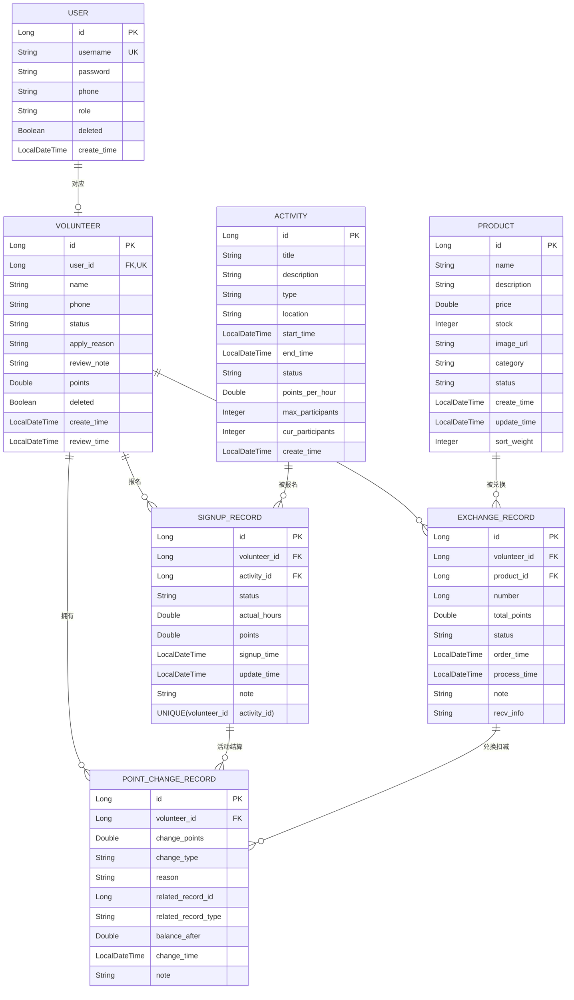

# 数据库作业：社区志愿服务平台

[TOC]

## 项目现状

当前仓库是一个 **前后端分离** 项目，已包含：

- `frontend/`：Vue 3 + TypeScript + Vite 的完整前端页面与业务流程。
- `backend/`：Spring Boot + JPA + Security 的后端工程骨架（含依赖与配置模板）。
- `test/`：用于批量生成/迁移测试数据的 Python 脚本（用户、活动、报名、积分、兑换等）。

## 技术栈

- 前端：Vue 3、TypeScript、Vue Router、Vite、ECharts、html2canvas、腾讯云 COS JS SDK。
- 后端：Java 25、Spring Boot 4、Spring Data JPA、Spring Security、MySQL、JWT、腾讯云 COS/STS。
- 数据脚本：Python（mysql-connector、faker、tqdm、bcrypt）。

## 主要业务模块

### 用户与认证

- 注册、登录、退出登录。
- 用户个人资料查询与更新。
- 志愿者申请、重新申请。
- 基于角色与登录状态的前端路由守卫（`ADMIN / VOLUNTEER / USER`）。

### 志愿活动

- 活动列表浏览、筛选。
- 活动报名/取消报名。
- 报名记录管理。
- 管理员侧活动管理（新增、编辑、审核报名、删除等）。

### 积分系统

- 志愿者积分总览与个人积分变动记录查询。
- 通过活动结算与兑换扣减产生积分变动。
- 管理员积分记录检索与人工调整。
- 提供 `migrate_volunteer_points.py` 用于将历史积分流水汇总回填到 `volunteer.points`。

### 积分兑换

- 商品列表浏览与兑换。
- 兑换记录查询。
- 管理员商品管理（含图片上传、上下架、库存与导入）。

### 数据导入与可视化

- 管理员可导入活动与商品数据。
- 数据看板包含 KPI、热力图、桑基图、气泡图、趋势图、留存曲线、雷达图等。

## 实体联系图



## 常见状态/枚举

- 用户角色：`ADMIN` / `VOLUNTEER` / `USER`
- 志愿者状态：`REVIEWING` / `CERTIFIED` / `REJECTED` / `SUSPENDED`
- 活动状态：`RECRUITING` / `CONFIRMED` / `ONGOING` / `COMPLETED` / `CANCELLED`
- 兑换商品状态：`AVAILABLE` / `UNAVAILABLE` / `SOLD_OUT` / `DELETED`

## 运行说明

### 前端

```bash
cd frontend
npm install
npm run dev
```

默认前端接口地址写在 `frontend/src/utils/api.ts`：

- `API_BASE_URL = http://localhost:20001`

### 后端（骨架）

```bash
cd backend
cp src/main/resources/application-template.yml src/main/resources/application.yml
# 按模板补充数据库、JWT、腾讯云 COS 等环境变量
./mvnw spring-boot:run
```

> 若你当前后端实际端口或 API 前缀与此不同，请同步修改前端 `API_BASE_URL`。

### 测试数据脚本

脚本位于 `test/`，可用于快速构造本地演示数据：

- `generate_users.py`
- `generate_activities.py`
- `generate_signup_records.py`
- `generate_hot_activity_signup_records.py`
- `generate_exchange_records.py`
- `generate_bonus_and_adjust_records.py`
- `migrate_volunteer_points.py`

建议按“用户 -> 活动 -> 报名 -> 兑换/积分调整 -> 积分迁移”顺序执行。
