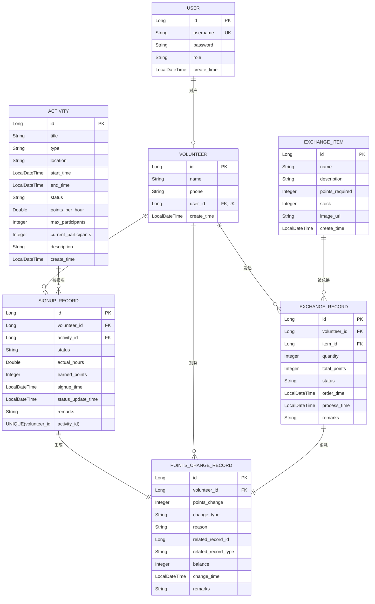

### 核心联系与业务规则详解

这个图中包含了超过5个实体和4种联系，完全满足你的作业要求。下表详细说明了其中几个**最关键的关联及其在业务和权限上的体现**：

1. **一对一**：`USER` ↔ `VOLUNTEER`
2. **一对多**：`VOLUNTEER` → `SIGNUP_RECORD`, `VOLUNTEER` → `POINTS_CHANGE_RECORD`
3. **多对多**：`VOLUNTEER` ↔ `ACTIVITY`（通过`SIGNUP_RECORD`）
4. **一对一衍生**：`SIGNUP_RECORD` → `POINTS_CHANGE_RECORD`（积分发放）
5. **一对多衍生**：`EXCHANGE_ORDER` → `POINTS_CHANGE_RECORD`（积分消耗）

### 💡 下一步开发建议

当你根据此图创建JPA实体类时，可以遵循以下顺序，步步为营：

1. **第一步（基础）**：创建 `User` 和 `Volunteer` 实体，并建立它们之间的一对一关系。
2. **第二步（核心）**：创建 `Activity` 和 `SignUpRecord` 实体，并建立多对多关联。这是业务的核心。
3. **第三步（衍生）**：创建 `PointsDetail` 实体，并与 `Volunteer`、`Activity`、`SignUpRecord` 建立关联。
4. **第四步（扩展）**：创建 `ExchangeItem` 和 `ExchangeOrder` 实体，完成积分消耗的闭环。

这个设计图不仅满足了你的作业要求，更构建了一个**逻辑自洽、权限清晰、可扩展性强**的完整业务模型。如果你在将图中某个关系转化为JPA实体代码时（例如，如何用 `@OneToOne` 注解配置 `User` 和 `Volunteer` 的关系）遇到困难，可以随时提问。
